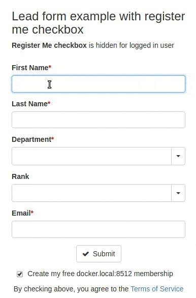
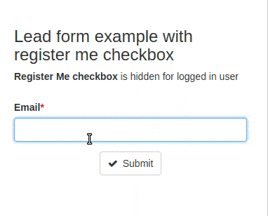
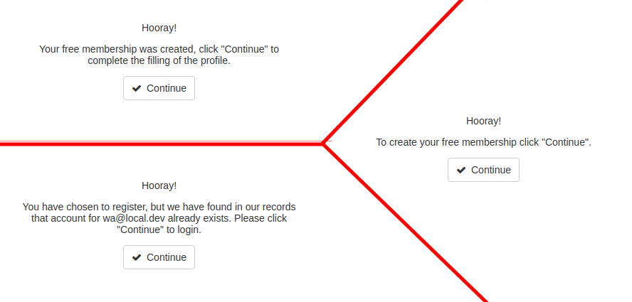

## Lead Forms

Code sample:
```html
<body>
  <script>
     // Load Cub widget asynchronously. Put this as high as possible so
     // widget will load faster.
     (function(){
       if (document.getElementById("cub-widget-script")) {return;}
       var firstScript = document.getElementsByTagName("script")[0];
       var cubJs = document.createElement("script");
       cubJs.id = "cub-widget-script";
       // See notes about widget versioning
       cubJs.src = "//cub-praetorian.netdna-ssl.com/cub-widget.js";
       firstScript.parentNode.insertBefore(cubJs, firstScript);
     }());
  </script>

  <div id="lead-form1">
    <!-- Lead Form will be rendered inside this element,
         replacing its previous contents.
         HINT: you can place a loader icon or text here, like this: -->
    Loading...
  </div>

  <!--
  Cub initialization script needs to be placed on the page only once, no matter
  how many forms do you have. You should place it below last form element which
  needs to be handled by Cub. Configure your forms in 'forms' parameter below:
  -->
  <script>
    var cubAsyncInit = function(cub) {
      // Configuration parameters
      cub.start({
        apiKey: '<your-public-API-key>',

        // 'forms' parameter is an object with CSS selectors as keys and form
        // options as values. CSS selectors identify parent containers for
        // forms to be rendered:
        forms: {
          '#lead-form1': {
            load: '<lead-form-ID>'  // Get this ID in Cub admin
          }
        }

      });
    };
  </script>
</body>
```

## "Server side" lead forms.

Server side lead forms are constructed in cub admin. Use the created lead form UID to
create lead form as in the example below.

### Providing initial data

If your site uses Cub widget for registration, widget will
automatically pre-populate known form fields for logged-in users. Or, you can
provide the initial values yourself by passing them in form configuration options,
like this:

```js
    ...
    forms: {
      '#lead-form1': {
        load: '<lead-form-ID>',
        // Initial field values:
        first_name: 'John',
        last_name: 'Doe',
        email: 'john.doe@example.com',
        ...
      }
    }
    ...
```

## "Client side" lead forms.
### Configuring

Cub generic form engine could be used for lead forms creation.
1. For required for notification rules and processing rules
2. The value when a multi-column form layout transforms into a single column (in px)
3. The width for a fieldset layout column in percents.
4. The width for a field layout column in percents for cases when the a multi-column layout is needed for a fieldset, not just for a form.
5. Optional, this class will be added to fieldset div container. E.g. cub-Row-column--separated would add border with spacings to Fieldset.
6. Optional, Last Name.
7. Required. Email.
8. The width for a Submit Button layout Column in percents.
9. Title for a Submit Button.
10. Legend for a Fieldset.

* This parameter accepts values from 0 to 100 and is a multiple of five (5, 10, 15...).

```js
  ...
  forms: {
    '#lead-form1': {
      action: 'leads',
      form: 'lfm_rMvQ1iRVRgpZ6Asw',  // 1
      responsiveBreakpoint: 700, // 2
      fieldsets: [{
        name: 'responsive-column',
        legend: 'Fieldset #1', // 10
        columnWidth: 100, // 3*
        className: "extraClassNameForFieldSet", // 5
        fields: [
          {
            name: 'first_name',
            label: 'First Name',
            type: 'text',
            width: 50 // 4*
          },
          { // 6
            name: 'last_name',
            label: 'Last Name',
            type: 'text'
          },
          { // 7
            name: 'email',
            label: 'Email',
            type: 'text',
            required: true
          },
        ]
      }],
      submitColumnWidth: 100, // 8*
      submit: 'Subscribe' // 9
    }
  }
  ...
```

See detailed fields description in [Fields docs](./fields.md)

### 'Register me' feature


Cub generic form can be configured to automatically register a new user and show a success message with a 'Continue' button. After clicking on this 'Continue' button, user will be redirected to the 'experience' page to continue registration process (existing users will redirect to the 'login' page).

If you defined [an onSuccess callback](./form-events.md#supported-callbacks), that has an async code, and want to make sure this code is done before the user sees the success message with 'Continue' button, you should return Deferred/Promise object from onSuccess callback and resolve this Deferred/Promise object when your async code is done. Of course, **this is optional**, but if you did not return Deferred/Promise object from the onSuccess callback, **CUB-widget will register the user and (after the user clicks on 'Continue' button) redirect to the next page('experience' or 'login') without waiting for your async code.** You can use helpers `cub.helpers.Deferred` or `cub.helpers.Promise`. See examples below.

**Field 'email' is required for successful registration.** Fields 'first_name', 'last_name', 'middle_name', 'organization' and 'position', if present, will be used to prefill user profile.

```js
  ...
  forms: {
    '#my-form': {
      action: 'dummy-api',
      fieldsets: [{
        {
          name: 'email',
          label: 'Email',
          type: 'text',
          required: true
        },
        // ...
        // config for other fields
        // ...
      }],
      // ...
      // other configs for generic form
      // ...

      // Register Me checkbox.
      // If checked and form has valid email it will
      //   (if there is no user with this email in DB)
      //   create new user and redirect to 'experience' page
      //     or
      //   (if there is user with this email in DB)
      //   show message 'You already registered' and redirect to 'login' page
      //     or
      //   (if registration API returned error)
      //   redirect to 'registration' page
      registerMe: {
        // enforced: false, // if true - user will not able to avoid 'Register Me'
        checked: true,
        label: 'Register Me',
        hideForLogged: true, // When true, hides checkbox for logged user. Default value true.
        maxTimeout: 5000 // default: 2000
                         // max timeout before showing 'success' message
                         // where user can click on 'Continue' button
                         // to go to 'experience' page
                         // (or 'login' page for existent users)
        // respectRedirect: false, // if set to true - will skip 'experience' and 'login' pages
                                   // and redirect to `redirect.to` url of 'Redirect' feature
        // skip_subscribe: false, // if set to true - will skip subscribe to
                                  // the site mailing lists with enabled "Subscribe at registration" flag
      }
      onSuccess: function(formData, fromElement, response) {
        var dfd = new cub.helpers.Deferred() // Deferred helper
        console.log('i am synchronous, no problem')

        // simplest async code
        setTimeout(function() {
          console.log('wait for me!')
          dfd.resolve() // resolve when async code done
                        // in case of Goolge Analitics you should
                        // resolve Deferred in 'hitCallback'
        }, 3000)

        return dfd.promise() // convert Deferred to Promise for safety
      }
    }
  }
  ...
```

## 'Redirect' feature


If you need to redirect user, use `redirect` option.
User will see success message with 'Continue' button. After clicking on 'Continue'
user will be redirected to the url provided in `to` key.
Be aware that **'Register Me' feature (unless respectRedirect is set to true)
has precedence over 'Redirect' feature.**
User will be redirected only if 'Register Me' is inactive or unchecked.

```js
  ...
  forms: {
    '#my-form': {
      action: 'dummy-api',
      // ...
      // other configs for generic form
      // ...
      redirect: {
        // to: '/', // string, must be valid url
        // or it can be function that must return valid url as string
        to: function (response) {
          // response - object, body of API response,
          // that usually represents instance created by submit.
          return '/?id=' + response.id;
        }
        message: 'You will be redirected to next page.' // optional
        // skipSuccessMsg: false, // if true - skip message and redirect right away
      },
    }
  }
  ...
```

## Email notifications

Email notification recipients can be configured in Cub admin in Lead Form
properties. It is also possible that some extra email notifications will be sent
during lead data processing.

## Form events

Lead Forms support the same events and custom handlers as Newsletter
Subscription Form, see [form events](form-events.md) for details.

## Custom 'success' message

By default, after the following message will show after successful submits:
'Thank you! Your request successfully submitted.'.
To change it you can use `successMsgText` config:
```js
  ...
  forms: {
    '#my-form': {
      action: 'dummy-api',
      // ...
      // other configs for generic form
      // ...
      successMsgText: 'Hooray!',
    }
  }
  ...
```
Be aware that `successMsgText` affects not only the success message
of simple submits but also those of the 'Register Me' feature.


Instead of text you can provide HTML with 'successMsgHTML' config.
'successMsgHTML' has precedence over 'successMsgText'.
```js
  ...
  forms: {
    '#my-form': {
      action: 'dummy-api',
      // ...
      // other configs for generic form
      // ...
      successMsgHTML: '' +
        '<div class="Form-successContent u-noMargin">' +
            '<p>My raw HTML.</p>' +
            '' +
            '<div class="cub-FormGroup cub-FormGroup--buttons">' +
              '<a class="cub-Button cub-Button--submit">' +
                '<span class="cub-Button-text">Go Home</span>' +
              '</a>' +
            '</div>' +
        '</div>',
    }
  }
  ...
```
